<div align="center">



</div>

## About

I'm Simone Anselmi, a Computer Science student and Software Developer
focused on building practical software and learning through projects.

I like understanding how things work, from application logic and data
processing to systems and infrastructure.

Currently completing my Computer Science degree and looking for
opportunities to grow as a Software Developer.

---

## Featured Projects

### HouseDocs

Windows desktop application for scanning, organizing and managing documents.

**C# · .NET · Windows**

[Repository](https://github.com/simo-ansel/HouseDocs)

---

### AgriWeather

Weather data pipeline and dashboard built around automated data collection,
processing and visualization.

**Python · Airflow · PostgreSQL · Docker · Streamlit**

[Repository](https://github.com/simo-ansel/AgriWeather)

---

### HealthETL

ETL project for processing healthcare data, storing transformed data in
PostgreSQL and generating analytical outputs.

**Python · Pandas · PostgreSQL · Docker**

[Repository](https://github.com/simo-ansel/HealthETL)

---

### ArchiveDocs

Application focused on managing and organizing documents.

**Software Development · Data Management**

[Repository](https://github.com/simo-ansel/ArchiveDocs)

---

### anshell

Personal website and developer showcase.

**HTML · CSS · JavaScript**

[Repository](https://github.com/simo-ansel/anshell)

---

## Other Projects

| Project | Description |
|---|---|
| `secure-linux-server` | Linux server hardening and security configuration |
| `log-monitoring-script` | Bash-based log monitoring and notification system |

---

## Technologies

### Languages

`Python` `C#` `C/C++` `Java` `JavaScript` `Bash` `SQL`

### Development

`.NET` `Git` `Docker` `PostgreSQL` `REST APIs`

### Systems

`Linux` `Windows` `Networking`

---

## How I Build

I prefer learning by building.

Most of my projects start from a problem, an idea or something I want
to understand better. I then develop, test and improve the solution
through iteration.

My goal is not to use as many technologies as possible, but to understand
the tools I use and build software that actually works.

---

## Currently

```text
Computer Science
      │
      ├── Software Development
      ├── Data & Backend
      ├── Systems & Linux
      └── Personal Projects
```

---

## GitHub

<div align="center">


</div>

---

<div align="center">

[GitHub](https://github.com/simo-ansel) ·
[LinkedIn](#) ·
[Portfolio](#)

</div>

---

<p align="center">
  <sub>Last updated automatically · <span id="year">2026</span></sub>
</p>
